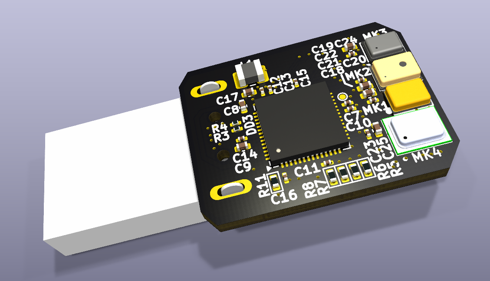
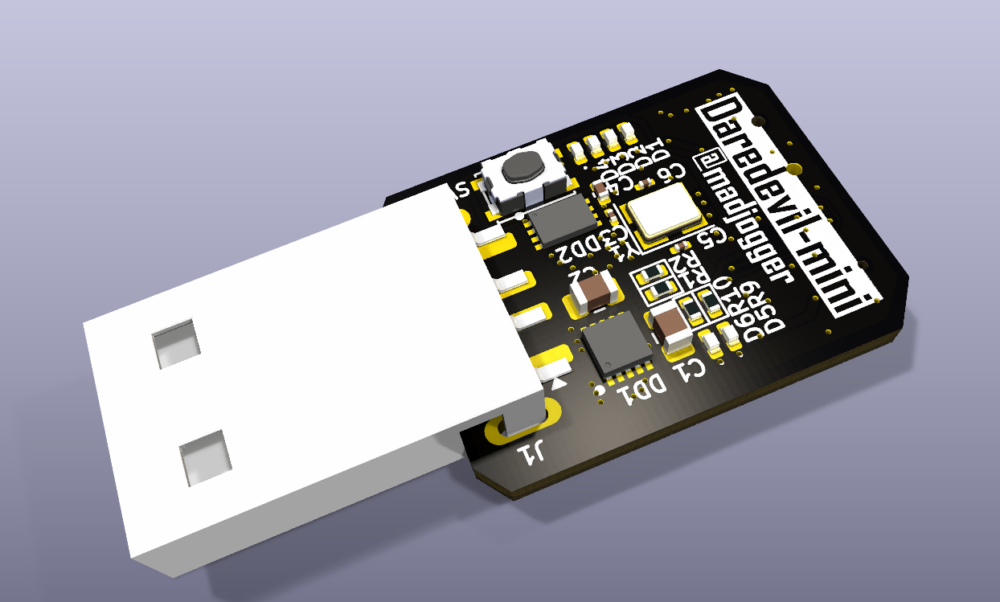

# Daredevil-mini

> USB MEMS microphone module with four selectable sensors on one board.  
> **Sensors:** INMP441 • MP34DT01 • SPH0645LM4 • MP23DB01.  
> Each sensor wired individually to **RP2040** core.  
> Form factor: **USB stick** (direct plug-in).  

---

## What’s on the board
- **Four MEMS microphones** for direct comparison:
  - INMP441  
  - MP34DT01  
  - SPH0645LM4  
  - MP23DB01
- All connected separately to **RP2040**  
  *(see schematic for detailed pinout)*
- **Two groups of LEDs**:
  - 2× status LEDs (power / activity)  
  - 4× level LEDs (visualize audio from active sensor)
- **BOOT button** for easy programming (UF2 bootloader compatible)
- Component layout matches **Raspberry Pi Pico** (same footprints / values for cost-reduction & rework flexibility)

---

## Power & Form Factor
- Powered directly from **USB-A plug**  
- Compact **flash-drive-style** PCB — just insert into USB port  
- No external power required

---

## Use Case
- Quick **A/B/C/D comparison** of MEMS microphones  
- Evaluate noise, sensitivity, frequency response, clipping  
- Decide on best sensor for a given project (voice, audio capture, beamforming, etc.)

---

## Quick Use
1. Plug **Daredevil-mini** into USB port.  
2. Hold **BOOT** and connect to enter RP2040 bootloader.  
3. Flash your firmware (UF2 or via SWD if needed).  
4. Select and test microphones, use LED bar as quick visual feedback.  
5. Log / stream audio over USB or I²S as defined in firmware.

---

## Notes
- Do not use multiple sensors at the same time (shared core, for comparison only).  
- Pin mapping for each microphone: **see schematic**.  
- Board re-buildable using **Pi Pico BOM** (same package sizes).  

---

